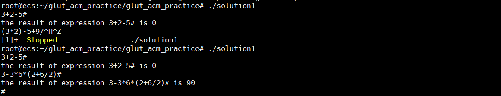
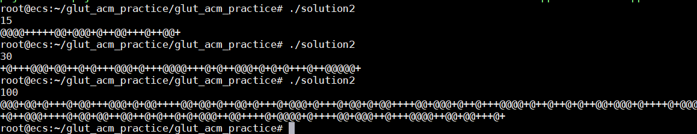
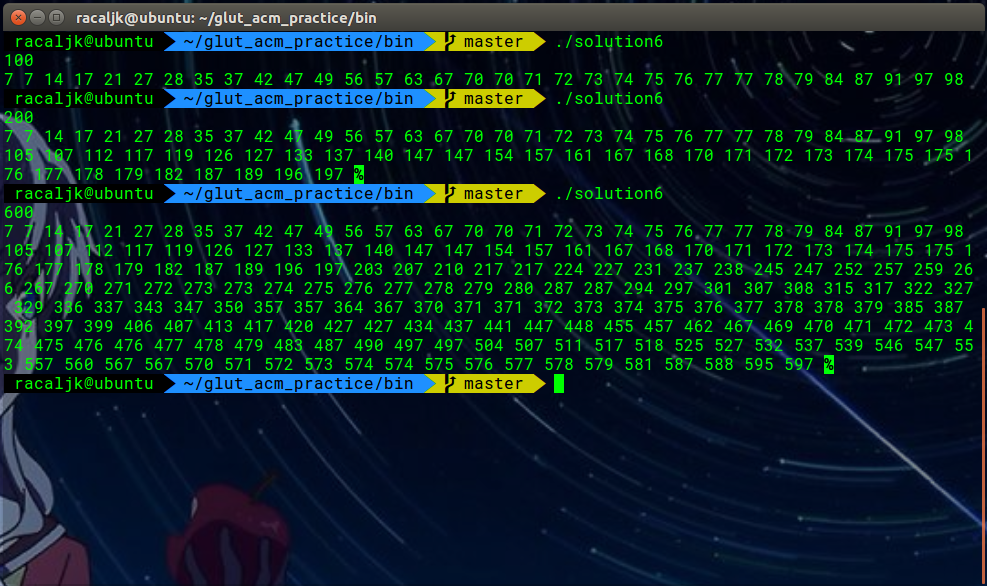
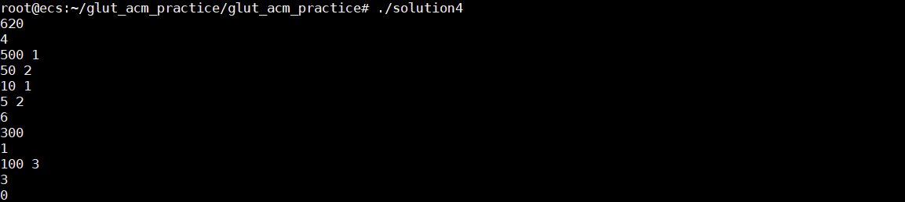
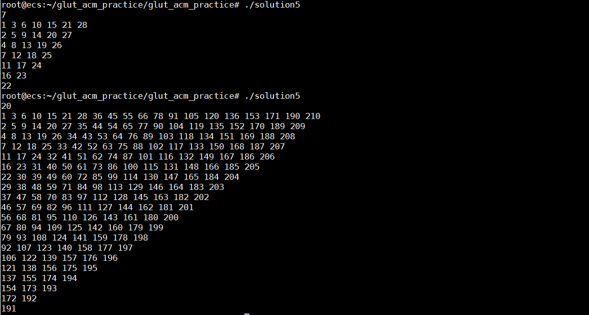
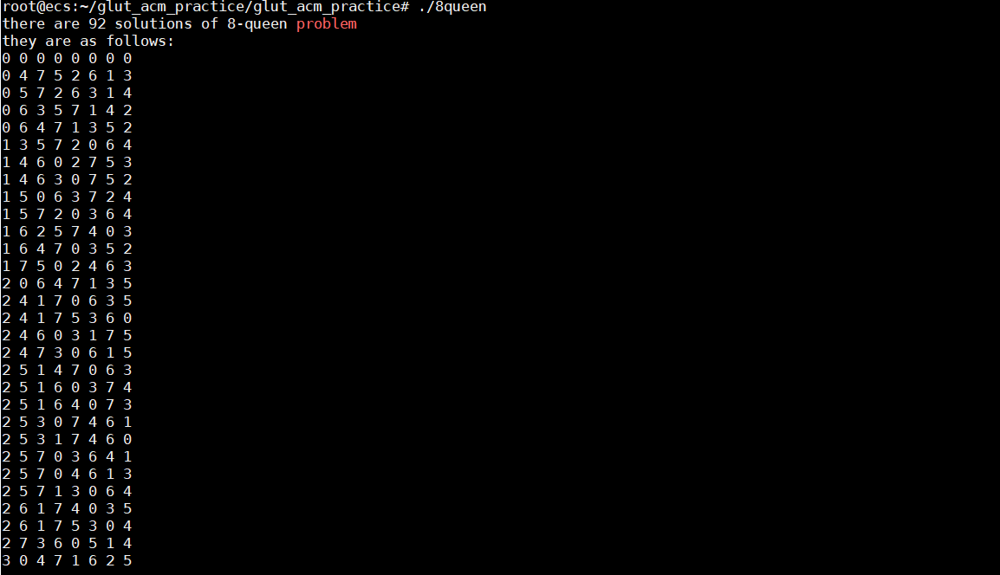
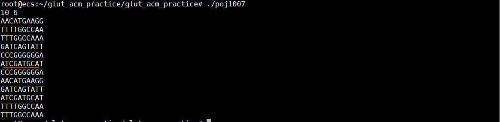
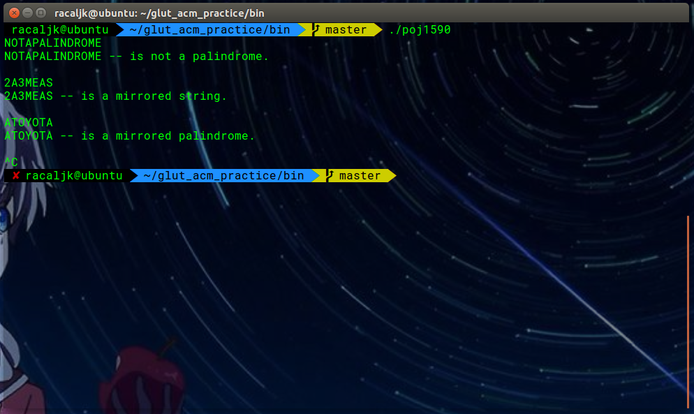
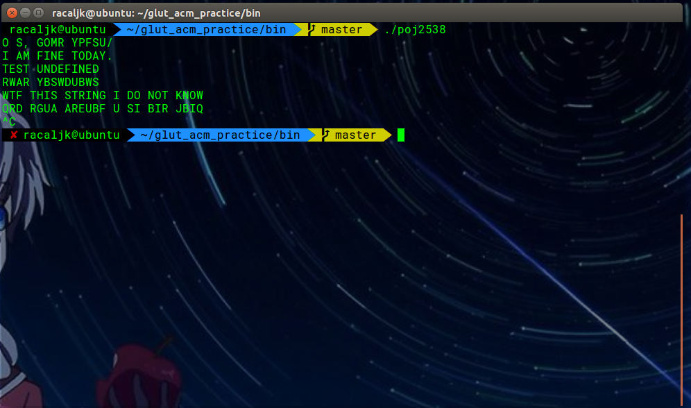
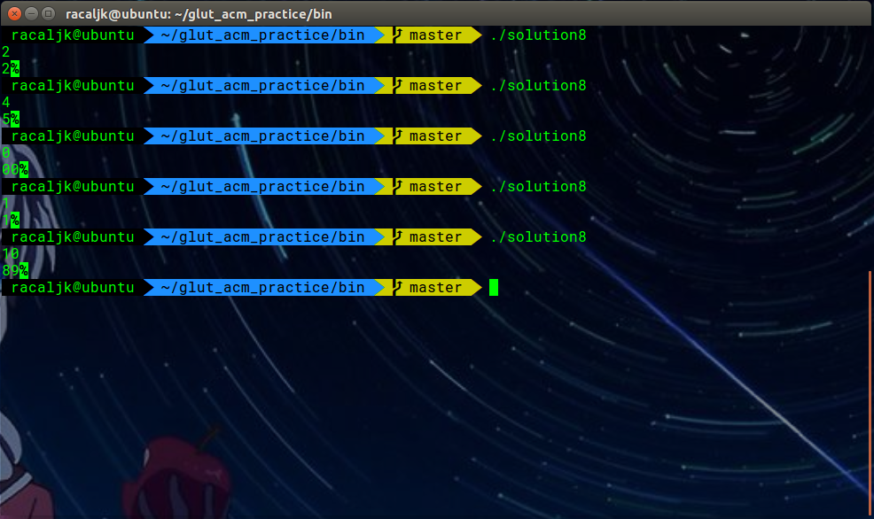

# 桂林理工大学ACM程序设计实践实习报告

## 2016级计算机6班 2017年11月6日
## 姓名：杨易 学号：3162052051639


## 1.实验题目
1. 基于栈的简易计算
> 一个算式的求值：求一个可能包含加、减、乘、除运算的中缀表达式的值。
2. 约瑟夫环问题
> 2n个人围成一个圆圈，从第一个人开始依次循环报数，每数到第九个人就将他扔入大海，如此循环直到仅剩n个人为止 。问怎样的排法，才能使每次投入大海的都是非教徒。
3. 字符串和数值计算
> 输出符合要求的在区间[0,N]内的数字
4. 贪心算法
> 用给定的6种钱币面值为2、5、10、20、50、100，用来凑 15元，编程计算，最少需要多少个钱币才能凑成某个给出的钱数。
5. 智力游戏
> 蛇形矩阵是由1开始的自然数依次排列成的一个矩阵上三角形。5. 数字字符串处理
>  输出7 和7 的倍数，还有包含7 的数字例如（17，27，37...70，71，72，73...）
6. 回溯法
> 经典八皇后问题
7. POJ字符串排序变个花样
>  DNA排序
8. POJ回文字 POJ WERTY,POJ 特殊温度表示计算
> 字符串操作和简易计算，根据要求输出格式化的结果
9. 递归
> 有一长度为N(1<=Ｎ<=10)的地板，给定两种不同瓷砖：一种长度为1，另一种长度为2，数目不限。要将这个长度为N的地板铺满

## 2.需求分析
1. 输入一串表达式，程序计算出表达式的结果
2. 输入一个数代表所有教徒的一半，程序求解所有教徒如何安排使得最终扔下海的是异教徒
3. 输入钱币面值和数量，以及要求的总额，计算如何选择使得钱币数量最少即能达到要求的总额
4. 输入矩阵宽度，输出蛇形三角矩阵
5. 输入一个数字，输出从0开始到该数字中满足要求的数
6. 无输入，输出八皇后的所有解答
7. 输入N个M长度的DNA序列字符，输出从最无序到最有序的字符串，注意该序列是题目指定的inversion number排序
8. 输入N个字符串，输出字符串是否为回文字符串;对字符串进行操作和根据题目进行计算
9. 输入N，使用两次递归计算即可

## 3.概要设计
1. 基于栈的简易计算
```cpp
public interface:
    //@summary 表达式计算器构造函数，禁止编译器类型转换
    //@param expr 待求值的表达式
    //@return 无返回值
    explicit ExprCalculator(const std::string & expr);
    
    //@summary 设置待求值的表达式
    //@param expr 待求值的表达式
    //@return ExprCalcuator 返回对象本身方便连贯调用
    ExprCalculator & setNewExpression(const std::string & expr);
    
    //@summary 计算表达式结果
    //@param 无参数
    //@return int 返回计算结果
    int work();
```

2. 约瑟夫环问题
```cpp
public interface:
    //@summary 循环链表构造函数，设置循环链表大小
    //@param size 循环链表大小
    //@return none
    explicit List(size_t size);

    //@summary 获取下一个未填充的位置
    //@param none
    //@return int 未填充的位置
    int getNextTrue();

    //@summary 进行下一轮的计算，得出待填充的位置
    //@param none
    //@return none
    inline void nextRound();

    //@summary 获取游标位置BAD DESIGN
    //@param none
    //@return int 返回游标位置
    inline int getCursor();

    //@summary 设置游标位置BAD DESIGN
    //@param index 游标位置
    //@return none
    inline void setCursor(int index);
```
3. 字符串和数值计算
```cpp
public interface:
    //@summary 判断[0,n]内符合要求的数字并输出
    //@param n 区间上限
    //@return none
    void weirdPrint(int n)
```

4. 八皇后问题
```cpp
public interface:
    //@summary 生成八皇后解
    //@param i 当前解的行数，为8时得出一个解
    //@return none
    void genQueen(int i)
```
5.DNA排序
```cpp
public interface:
    //@summary 求解特殊的排序值
    //@param str待排序的字符串
    //@return int 特殊排序值
    int inversionNumber(const std::string & str)

```

## 4.详细设计
1. 使用两个栈分别存储数字和运算符，遇到左括号入栈，遇到运算符判断如果该运算符优先级大于栈顶则入栈，否则操作数出栈并与运算符一起参与计算，计算结果入栈。遇到右括号持续上述步骤直到栈顶元素为'('。
    注意该程序不支持一位以上的数字计算以及负数计算
```cpp
private implementation:
    //@field expr_ 字符串表达式
    std::string expr_;
    //@field opcode 运算符栈，计算前默认'#'字符入栈
    std::stack<char> opcode;
    //@field integer 数字栈，存放数字
    std::stack<int> integer;
pseudocode:
    for char in expressionStr:
        if char in [0-9]:
            push char into integer stack
        else if char in [=-*/()]
            r = getPrecedenceBetween(stackTop,char)
            if(r)
                push char into opcode stack
            else 
                result = do calcuating
                push result into integer
        else if char == '('
            push '(' into opcode stack
        else
            loop 
                pop integer and opcode stack
                yield result from below
                push result into stack
            while opcode top !=')'
```
2. 循环要抛到海里的人的次数，每次先求出游标位置，然后将至涂黑，游标移动至下一个未涂黑的位置，注意游标位置如果在末尾需要移动到头部
```cpp
private implementation:
    //@method get next unfilled position index
    inline void next();
    //@field a circle list to simulate this problem
    std::vector<int> list;
    //@field cursor usded to store current index
    size_t cursor;

pseudocde:
    set dropCount = 0
    while dropCount == required:
        getNextRoundPosition
        if current position is unfilled:
            fill it!
        else
            getNextUnfilledPosition
            fill it;
        dropCount++
```
3. 从最大的钱币开始循环到最小的钱币，判断如果该钱币乘以次数能满足要求则总额减去该值，同时一个变量存储钱币数量，如此循环直到结束，如果总额有剩余则输出"Impossible"否则输出钱币数量
```cpp
pseudocode:
    set count = 0
    for maxValue to minValue:
        if totalValue - maxValue * curCount >= 0
            count += curCount;

```
4. 先创建矩阵宽度个数组，然后从小到大依次填充，最后O(N^2)内模拟N个数组的变形以实现题目要求的蛇形效果
```cpp
pseudocode:
    for x in range [0,N]:
        arr = generate array(x+1)
        store arr into matrix
    for y in all matrix
        temp  =0
        loop 
            print y[temp++]
        end
```
5. 从0开始循环到输入的数，1)数字对7求余如果为0则满足要求2)数字转化为字符串判断是否有"7"如果有则满足要求，如果上述两条不满足则不输出该数字
6. 数据量较小，使用递归依次计算八个皇后该摆放的位置（tempRow存放），函数体中循环8列，判断是否与之前摆放位置冲突，如果不冲突则存入tempRow，并递归调用。递归终结条件为最终8行位置全部摆放完毕。
7. 输入字符串，使用子过程计算特殊的排序结果（即inversion number sort），并与字符串本身一同存放至multimap（因为key可能重复，不能使用map），由于multimap是有序红黑树，最终迭代输出结果即可。
```cpp
private implementation:
    //@function 求特殊排序值
    //@param str 待排序字符串
    //@return int 特殊排序值
    int inversionNumber(const std::string & str);
pseudocode:
    globalMap = {}//std::multimap

    userInput = getUserInput()
    while userInput != end :
        sortedValue = inversionNumber(userInput)
        store [input,sortedValue] into globalMap
        userInput = getUserInput()

    for [key,value] in globalMap.items():
        print key,",",value

```
8. 回文字处理，使用硬编码直接将题目要求的回文数字/字符写入代码，方便后面计算；特殊天气计算按照题目描述计算即可，由于缺少其他情况，故程序不完全符合题目要求。
9. 全局变量存储解的数，`pave()`函数递归调用自身并，当恰好铺满N时全局变量加一，最终main函数输出结果
```cpp
private implementation:
    //@function 递归求解解答总数，总数由全局变量保存
    //@param int 待铺的长度
    //@return none
    void pave(int n)
```
## 5.使用说明
Prerequisite:
+ make 工具
+ g++ version >= 4.8.4
+ git 

Usage for linux:
```shell
~$ git clone https://github.com/NagaseMinato/glut_acm_practice.git
~$ cd glut_acm_practice
~$ make
~$ #make clean
```
## 6.测试结果
1. 基于栈的简易计算

2. 约瑟夫环问题

3. 字符串和数值计算

4. 贪心算法

5. 智力游戏

6. 回溯法

7. POJ字符串排序变个花样

8. POJ回文字 POJ WERTY,POJ 特殊温度表示计算


9. 递归
