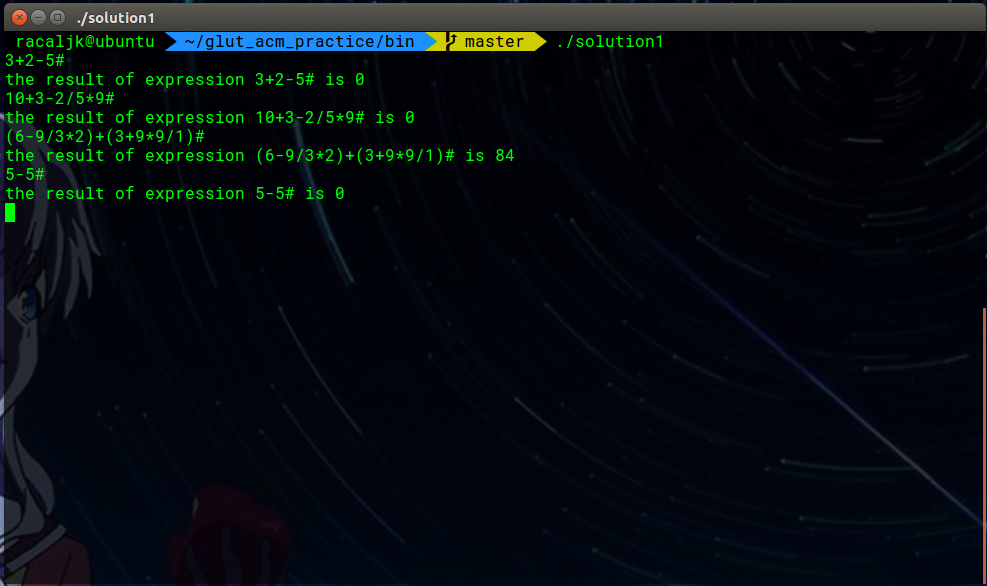

# GLUT ACM Practice Summary

[](https://www.codacy.com/app/yangyijk/glut_acm_practice?utm_source=github.com&utm_medium=referral&utm_content=cthulhujk/glut_acm_practice&utm_campaign=badger)
[]()
## 班级:2016级计算机6班 2017年11月6日
## 姓名:杨易 学号:3162052051639
## 实验题目:基础：基于栈的简易计算

This summary was auto generated by python, you could found it at **https://github.com/cthulhujk/glut_acm_practice**.

## 1.Lab Topic
+ 基础：基于栈的简易计算
> 一个算式的求值：求一个可能包含加、减、乘、除运算的中缀表达式的值。

## 2.Requirement Analysis
输入一串表达式，程序计算出表达式的结果

## 3.APIs Design
```cpp
///////////////////////////////////////////////////////////////////////
/// Public Interface: Note that these interfaces were even not actually
/// APIs which could be called by other functions.
///////////////////////////////////////////////////////////////////////

        //@summary 表达式计算器构造函数，禁止编译器类型转换
      //@param expr 待求值的表达式
      //@return 无返回值
      explicit ExprCalculator(const std::string & expr);

      //@summary 设置待求值的表达式
      //@param expr 待求值的表达式
      //@return ExprCalcuator 返回对象本身方便连贯调用
      ExprCalculator & setNewExpression(const std::string & expr);

      //@summary 计算表达式结果
      //@param 无参数
      //@return int 返回计算结果
      int work();
    
```
## 4.Detail Design
使用两个栈分别存储数字和运算符，遇到左括号入栈，遇到运算符判断如果该运算符优先级大于栈顶则入栈，否则操作数出栈并与运算符一起参与计算，计算结果入栈。遇到右括号持续上述步骤直到栈顶元素为'('。 注意该程序不支持一位以上的数字计算以及负数计算
```cpp
///////////////////////////////////////////////////////////////////////
/// Pseudocode implementations: implementation details of program
/// described by pseudocode. Its syntax was familiar to Python.
///////////////////////////////////////////////////////////////////////

//@field expr_ 字符串表达式
std::string expr_;
//@field opcode 运算符栈，计算前默认'#'字符入栈
std::stack<char> opcode;
//@field integer 数字栈，存放数字
std::stack<int> integer;

for char in expressionStr:
    if char in [0-9]:
        push char into integer stack
    else if char in [=-*/()]
        r = getPrecedenceBetween(stackTop,char)
        if(r)
            push char into opcode stack
        else
            result = do calcuating
            push result into integer
    else if char == '('
        push '(' into opcode stack
    else
        loop
            pop integer and opcode stack
            yield result from below
            push result into stack
        while opcode top !=')'
    
```

## 5.Building and running
I have A LOT free time to do uesless work. Obviously this project can easily use g++/clang compiled for all, but I still write a cmake rules to make it more engineered and modernization, even in previous you could see manual makefile. Notice that this project was licensed under [MIT License](LICENSE), which means you can do almost everything you want with it. Anyway, I just want to make it more fun :-)

Prerequisite:
+ unix make
+ g++ version >= 4.8.4
+ git
+ cmake >= 3.5.0

For linux users:
```shell
$ git clone https://github.com/NagaseMinato/glut_acm_practice.git
$ cd glut_acm_practice/build
$ cmake .. -G"Unix Makefiles"
$ make -j8
$ ../bin/solution1  # try to run a built program
$ make clean
```
There are more details about each programs in testsuites, you can run it to see more if you had been installed `valgrind` toolchain:
```shell
$ sudo apt-get install valgrind
$ make test         # run testsuite
```
For windows users:
```
> git clone https://github.com/NagaseMinato/glut_acm_practice.git
> cd glut_acm_practice/build
> cmake .. -G"Visual Studio 15 2017"
```
Then double-click `glut_acm_practice.sln`, select a sub project and build it, enjoy it!

## 6.Test Output
一个算式的求值：求一个可能包含加、减、乘、除运算的中缀表达式的值。


## 7.Appendix
+ All programs had been passed my own test cases, you can add/modify/delete testcases into corresponding test/*.data file. For me, I eliminated all warnings and memory leaking using [valgrind](http://valgrind.org/)
+ For more information about how to run these test, see `# 5.Usage` section
```python
Test project /home/racaljk/Desktop/glut_acm_practice/build
      Start  1: test_running__01pack_v1.0
 1/16 Test  #1: test_running__01pack_v1.0 ............   Passed    0.01 sec
      Start  2: test_running__8queen
 2/16 Test  #2: test_running__8queen .................   Passed    0.00 sec
      Start  3: test_running__poj3299_WA
 3/16 Test  #3: test_running__poj3299_WA .............   Passed    0.00 sec
      Start  4: test_running__poj_1007_40percentAC
 4/16 Test  #4: test_running__poj_1007_40percentAC ...   Passed    0.01 sec
      Start  5: test_running__poj_1590_33percentAC
 5/16 Test  #5: test_running__poj_1590_33percentAC ...   Passed    0.00 sec
      Start  6: test_running__poj_2386_49percentAC
 6/16 Test  #6: test_running__poj_2386_49percentAC ...   Passed    0.00 sec
      Start  7: test_running__poj_2538_47percentAC
 7/16 Test  #7: test_running__poj_2538_47percentAC ...   Passed    0.00 sec
      Start  8: test_running__poj_3278_31percentAC
 8/16 Test  #8: test_running__poj_3278_31percentAC ...   Passed    0.00 sec
      Start  9: test_running__poj_3979_30percentAC
 9/16 Test  #9: test_running__poj_3979_30percentAC ...***Failed    0.13 sec
      Start 10: test_running__solution1
10/16 Test #10: test_running__solution1 ..............   Passed    0.00 sec
      Start 11: test_running__solution2
11/16 Test #11: test_running__solution2 ..............   Passed    0.00 sec
      Start 12: test_running__solution3
12/16 Test #12: test_running__solution3 ..............   Passed    0.00 sec
      Start 13: test_running__solution4
13/16 Test #13: test_running__solution4 ..............   Passed    0.00 sec
      Start 14: test_running__solution5
14/16 Test #14: test_running__solution5 ..............   Passed    0.00 sec
      Start 15: test_running__solution6
15/16 Test #15: test_running__solution6 ..............   Passed    0.00 sec
      Start 16: test_running__solution8
16/16 Test #16: test_running__solution8 ..............   Passed    0.00 sec

94% tests passed, 1 tests failed out of 16

Total Test time (real) =   0.19 sec
```

