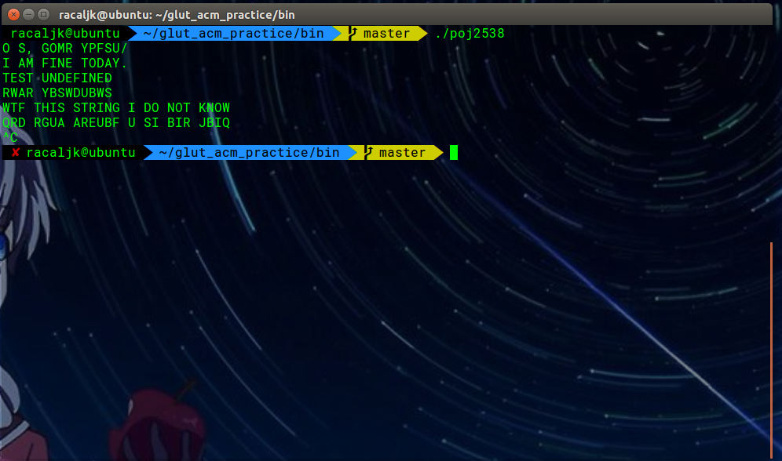

# GLUT ACM Practice Summary

[](https://www.codacy.com/app/yangyijk/glut_acm_practice?utm_source=github.com&utm_medium=referral&utm_content=cthulhujk/glut_acm_practice&utm_campaign=badger)
[]()
## 班级:2016级计算机6班 2017年11月6日
## 姓名:杨易 学号:3162052051639
## 实验题目:POJ：Lake Counting

This summary was auto generated by python, you could found it at **https://github.com/cthulhujk/glut_acm_practice**.

## 1.Lab Topic
+ POJ：Lake Counting
>  Due to recent rains, water has pooled in various places in Farmer John's field, which is represented by a rectangle of N x M (1 <= N <= 100; 1 <= M <= 100) squares. Each square contains either water ('W') or dry land ('.'). Farmer John would like to figure out how many ponds have formed in his field. A pond is a connected set of squares with water in them, where a square is considered adjacent to all eight of its neighbors.Given a diagram of Farmer John's field, determine how many ponds he has. 

## 2.Requirement Analysis
输入水塘矩阵，如果为'W'则深度搜索周围方块直到访问完周围所有'W'

## 3.APIs Design
```cpp
///////////////////////////////////////////////////////////////////////
/// Public Interface: Note that these interfaces were even not actually
/// APIs which could be called by other functions.
///////////////////////////////////////////////////////////////////////

      //@summary 深度优先搜索
      //@param x,y 当前搜索的点
      //@return none
      void dfs(int x, int y);
      
```
## 4.Detail Design
循环水塘每个方格，只要遇上'W'就开始DFS,直到周围没有'W',DFS结束，回到主循环，计数器加一
```cpp
///////////////////////////////////////////////////////////////////////
/// Pseudocode implementations: implementation details of program
/// described by pseudocode. Its syntax was familiar to Python.
///////////////////////////////////////////////////////////////////////

void dfs(int x, int y) {
    int pos[8][2] = { {0,1},{0,-1},{1,0},{-1,0},{1,1},{-1,-1},{1,-1},{-1,1} };
    for (int i = 0; i < 8; i++) {
        int nx = x + pos[i][0];
        int ny = y + pos[i][1];
        if (nx < 0 || ny < 0 || nx >= n || ny >= m) {
        	continue;
        }
        if (field[nx][ny] == 'W') {
            field[nx][ny] = '.';
            dfs(nx,ny);
        }
    }
}
      
```

## 5.Building and running
I have A LOT free time to do uesless work. Obviously this project can easily use g++/clang compiled for all, but I still write a cmake rules to make it more engineered and modernization, even in previous you could see manual makefile. Notice that this project was licensed under [MIT License](LICENSE), which means you can do almost everything you want with it. Anyway, I just want to make it more fun :-)

Prerequisite:
+ unix make
+ g++ version >= 4.8.4
+ git
+ cmake >= 3.5.0

For linux users:
```shell
$ git clone https://github.com/NagaseMinato/glut_acm_practice.git
$ cd glut_acm_practice/build
$ cmake .. -G"Unix Makefiles"
$ make -j8
$ ../bin/poj_2538_47percentAC  # try to run a built program
$ make clean
```
There are more details about each programs in testsuites, you can run it to see more if you had been installed `valgrind` toolchain:
```shell
$ sudo apt-get install valgrind
$ make test         # run testsuite
```
For windows users:
```
> git clone https://github.com/NagaseMinato/glut_acm_practice.git
> cd glut_acm_practice/build
> cmake .. -G"Visual Studio 15 2017"
```
Then double-click `glut_acm_practice.sln`, select a sub project and build it, enjoy it!

## 6.Test Output
 Due to recent rains, water has pooled in various places in Farmer John's field, which is represented by a rectangle of N x M (1 <= N <= 100; 1 <= M <= 100) squares. Each square contains either water ('W') or dry land ('.'). Farmer John would like to figure out how many ponds have formed in his field. A pond is a connected set of squares with water in them, where a square is considered adjacent to all eight of its neighbors.Given a diagram of Farmer John's field, determine how many ponds he has. 


## 7.Appendix
+ All programs had been passed my own test cases, you can add/modify/delete testcases into corresponding test/*.data file. For me, I eliminated all warnings and memory leaking using [valgrind](http://valgrind.org/)
+ For more information about how to run these test, see `# 5.Usage` section
```python
Test project /home/racaljk/Desktop/glut_acm_practice/build
      Start  1: test_running__01pack_v1.0
 1/16 Test  #1: test_running__01pack_v1.0 ............   Passed    0.01 sec
      Start  2: test_running__8queen
 2/16 Test  #2: test_running__8queen .................   Passed    0.00 sec
      Start  3: test_running__poj3299_WA
 3/16 Test  #3: test_running__poj3299_WA .............   Passed    0.00 sec
      Start  4: test_running__poj_1007_40percentAC
 4/16 Test  #4: test_running__poj_1007_40percentAC ...   Passed    0.01 sec
      Start  5: test_running__poj_1590_33percentAC
 5/16 Test  #5: test_running__poj_1590_33percentAC ...   Passed    0.00 sec
      Start  6: test_running__poj_2386_49percentAC
 6/16 Test  #6: test_running__poj_2386_49percentAC ...   Passed    0.00 sec
      Start  7: test_running__poj_2538_47percentAC
 7/16 Test  #7: test_running__poj_2538_47percentAC ...   Passed    0.00 sec
      Start  8: test_running__poj_3278_31percentAC
 8/16 Test  #8: test_running__poj_3278_31percentAC ...   Passed    0.00 sec
      Start  9: test_running__poj_3979_30percentAC
 9/16 Test  #9: test_running__poj_3979_30percentAC ...***Failed    0.13 sec
      Start 10: test_running__solution1
10/16 Test #10: test_running__solution1 ..............   Passed    0.00 sec
      Start 11: test_running__solution2
11/16 Test #11: test_running__solution2 ..............   Passed    0.00 sec
      Start 12: test_running__solution3
12/16 Test #12: test_running__solution3 ..............   Passed    0.00 sec
      Start 13: test_running__solution4
13/16 Test #13: test_running__solution4 ..............   Passed    0.00 sec
      Start 14: test_running__solution5
14/16 Test #14: test_running__solution5 ..............   Passed    0.00 sec
      Start 15: test_running__solution6
15/16 Test #15: test_running__solution6 ..............   Passed    0.00 sec
      Start 16: test_running__solution8
16/16 Test #16: test_running__solution8 ..............   Passed    0.00 sec

94% tests passed, 1 tests failed out of 16

Total Test time (real) =   0.19 sec
```

